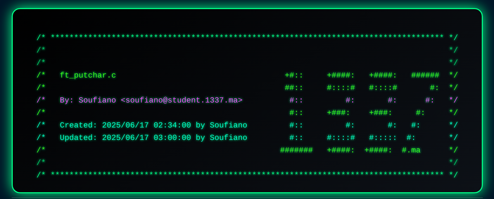

# 1337 Header Generator & Injector

---

## ⚠️ Project Status

This project is **deprecated** and has been archived.

👉 You are strongly encouraged to migrate to the newer, actively maintained project:

**➡️ ****[https://github.com/SoufianoDev/1337-header-injector](https://github.com/SoufianoDev/1337-header-injector)**

### Why migrate?

* ✅ Written in **C** (aligned with 1337 / 42 ecosystem)
* ✅ More **stable** and actively maintained
* ✅ **Simpler CLI** and easier to use
* ✅ Better integration with real 1337 workflows

---

## Overview

A minimal, **zero-dependency** Java utility that prepends the iconic 1337 School style ASCII header to your source files.

---

## Preview



---

## ✨ Features

* Single file injection
* Bulk file processing
* Recursive project-wide injection
* Automatic metadata (filename, author, timestamps)
* ASCII alignment preservation
* Zero external dependencies (fat JAR)

---

## 🚀 Quick Start

### Clone & Build

```bash
git clone https://github.com/SoufianoDev/1337HeaderGenerator.git
cd 1337HeaderGenerator
mvn clean package
```

---

## 📦 Programmatic Usage

```java
import com.soufianodev.LeetHeaderGenerator;

public class Main {
    public static void main(String[] args) throws Exception {

        LeetHeaderGenerator leetHeader = new LeetHeaderGenerator();

        leetHeader.setStudentData("SoufianoDev", "soufianodev@student.1337.ma");

        leetHeader.addHeaderToSingleFile("src/com/soufianodev/MyFile.c");

        leetHeader.addHeaderToSelectedFiles(
            List.of("ft_putchar.c", "strlibrary.h", "Pool.kt","FtPrintComb.java")
        );

        leetHeader.addHeaderToAllProjectFiles(".java", ".c", ".kt");
    }
}
```

---

## 📜 License

This project is licensed under the **GNU General Public License v3.0**.

---

## 🧑‍💻 Author

Soufiano Dev
