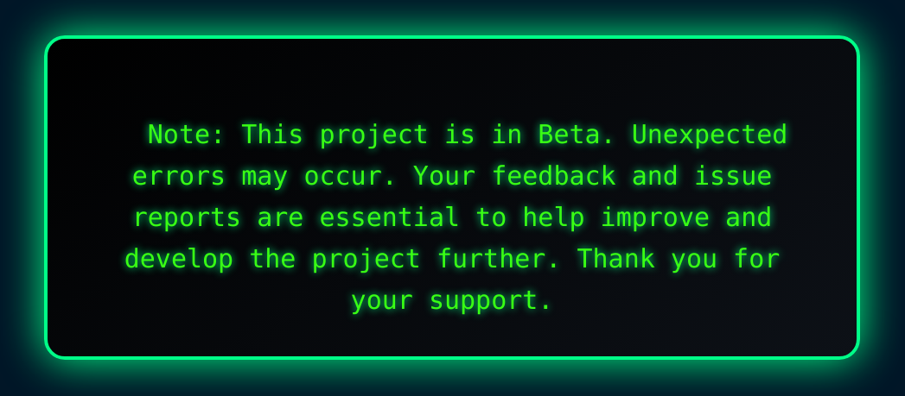

# 1337 Header Generator

<p align="center">
  <a href="https://www.oracle.com/java">
    
  </a>
  <a href="https://en.wikipedia.org/wiki/C_(programming_language)">
    
  </a>
  <a href="#">
    
  </a>
  <a href="https://www.gnu.org/licenses/gpl-3.0">
    
  </a>
</p>

<p align="center">
  
    &nbsp;&nbsp;&nbsp;

  
</p>


#### A minimal, **zero-dependency** Java utility that prepends the iconic [1337 School](https://1337.ma/) style ASCII header to your source files.





---

## ✨ Features

- **Single File Injection**: Add a header to one specified file.
- **Bulk Injection**: Process a list of files in one call.
- **Project-wide Injection**: Recursively inject headers into files matching given extensions (e.g., `.c`, `.java`, `.kt`).
- **Automatic Metadata**: Dynamically replaces placeholders with **filename**, **author**, **email**, **creation**, and **update timestamps**.
- **Alignment Guarantee**: Maintains the original ASCII-art layout regardless of filename length.
- **Zero Dependencies**: Ships as a single fat JAR—no external libraries.

---

## 📸 Header Preview


---

## 🚀 Quick Start

### 1. Clone & Build

```bash
git clone https://github.com/SoufianoDev/1337HeaderGenerator.git
cd 1337HeaderGenerator
mvn clean package
```

## Programmatic Usage :

```java
import com.soufianodev.LeetHeaderGenerator;

public class Main {
    public static void main(String[] args) throws Exception {

        LeetHeaderGenerator leetHeader = new LeetHeaderGenerator();

        leetHeader.setStudentData("SoufianoDev", "soufianodev@student.1337.ma");

        // Single file
        leetHeader.addHeaderToSingleFile("src/com/soufianodev/MyFile.c");

        // Selected files
        leetHeader.addHeaderToSelectedFiles(
            List.of("ft_putchar.c", "strlibrary.h", "Pool.kt","FtPrintComb.java")
        );

        // All project files with extensions
        generator.addHeaderToAllProjectFiles(".java", ".c", ".kt");
    }
}
```

---

## 🗂️ Project Structure

```
1337HeaderGenerator/
├── LICENSE
├── README.md
├── pom.xml                # Maven build file
├── src/
│   ├── main/java/com/soufianodev/
│   │   ├── LeetHeaderGenerator.java
│   │   └── Main.java
│   └── test/java/         # Unit tests (TBD)
└── docs/                  # Assets (header-preview.png, etc.)
```

---

## 🤝 Contributing

1. **Fork** the repository
2. Create a **feature branch** (`git checkout -b feature/foo`)
3. **Commit** your changes (`git commit -m "feat: add foo"`)
4. **Push** and open a **Pull Request** 🚀

Please adhere to the existing code style and include tests for new features.

---

## 📜 License

This project is licensed under the **GNU General Public License v3.0**. See the full [LICENSE](LICENSE) file for more information.

---

## 🧑‍💻 Author

**Soufiano Dev** – [@SoufianoDev](https://github.com/SoufianoDev)
